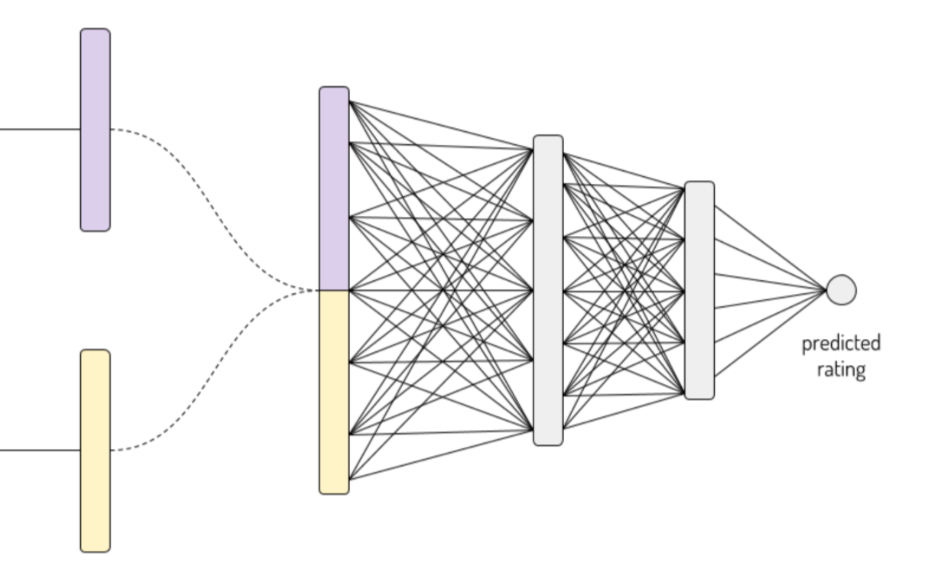

# High-Cardinality-Cetegorical-Featue-Handling

E-mail : [yltsai0609@gmail.com](yltsai0609@gmail.com) <br>

## Requirements

```
numpy==1.16.4
pandas==0.24.2
tensorflow==1.14.0
scikit-learn==0.21.3
xgboost==0.90
```

`pip install -r requirements`

## Introduction

類別特徵(nominal feature)，有的特徵會有非常多類別，我們稱之為高基數類別特徵(high cardinality nomial feature)，常見的包含(地區，行政區，ip位置，會員id，會員所屬校區，商品id，影片id，甚至是ubike在台北市的站點等)。<br>
在高基數類別特徵的預測中，由於各項特徵對預測目標(target)有不同的影響，但又並非是有序特徵(ordinal feature)一般有順序性，因此對於Tree-based model來說非常容易造成overfitting。
本篇實作了

* A Preprocessing Scheme for High-Cardinality Categorical Attributes in Classification and Prediction Problems[[1]](#ref)

* Entity Embeddings of Categorical Variables[[2]](#ref)

兩種解決high cardinality的encoding方式並以Label Encoding, One-Hot Encoding作為benchmark進行比較，並且用解釋了[[1]](#ref)中所提到的Target Encoding(又稱mean encoding, likelihood encoding, impact encoding)其中的參數，你可以直接執行 main.py獲取結果，或是從display_notebook.ipynb閱讀實作的code。<br>

## Conclusion

在Tree-Based的模型中我們使用XGBoost並且沒有進行任何調參 : 

|Encoding|AUC on validation set|
|-------|----------------------|
|One-Hot|0.732|
|Label|0.729|
|Embedding|0.765|
|Target|0.844|
|Regularized Target|0.856|

* 這樣的結果並不是通用性在每個資料集，在每個資料集上做實驗仍然是一個較穩當的做法。
## Data

這次的示範資料集是從Kaggle上2013年的[Amazon員工訪問權限預測挑戰賽](https://www.kaggle.com/c/amazon-employee-access-challenge)中取得
這個資料集，該資料集收集了Amazon公司中各個員工針對每個資源(例如網頁的logging)的訪問紀錄，當員工屬於能夠取得訪問權限時，系統卻不給訪問，又要向上申請才能取得權限，一來一往浪費的非常多時間，因此這場比賽希望能夠建構模型，減少員工訪問權限所需的人工流程，我們取出5個特徵如下 :

* Feature (X)

> RESOURCE : 資源ID

> MGR_ID : 員工主管的ID 

> ROLE_FAMILY_DESC : 員工類別擴展描述 (例如 軟體工程的零售經理)

> ROLE_FAMILY : 員工類別 (例如 零售經理)

> ROLE_CODE : 員工角色編碼 (例如 經理)

* Target (Y)

> ACTION : 

 >> 1 : RESOURCE 訪問權限取得
 
 >> 0 : RESOURCE 禁止訪問
 
 各特徵基數值
 
 |feature|count of unqiues|
 |-------|----------------|
 |RESOURCE|6711|
 |MGR_ID|4062|
 |ROLE_FAMILY_DESC|2201|
 |ROLE_FAMILY|67|
 |ROLE_CODE|337|
 

### Target encoding
**********************************************
#### how it work?

Target encoding的中心思想為 :
將類別特徵轉換為數值特徵，使用該特徵中每個種類對於target的mean值:
例如特徵ROLE_FAMILY

|value|target|target encoding value|
|-----|------|---------------------|
|118424|1|1|
|22434|0|0.33|
|118424|1|1|
|22434|1|0.33|
|1855|0|0|
|118424|1|1|
|118424|1|1|
|118424|1|1|
|22434|0|0.33|

透過以上我們可以發現 ROLE_FAMILY 為 118424時 target 都會 = 1，22434則是1個為1, 2個為0，因此平均為0.33，
如此一來我們將類別特徵透過target值轉成數值型特徵。

#### estimated_mean / overall_mean
**********************************************

* overall mean : 在此例子中，如果我們完全不看ROLE_FAMILY的值，單純看有幾筆資料，幾個target = 1, 幾個 = 0
則我們可以得到共9個值, 6個target = 1，3個target = 0， <b>因此在不考慮ROLE_FAMILY帶有的資訊的情況下</b>， overall_mean = 0.66

* estimated mean : 
我們可以從上述例子看到，ROLE_FAMILY中，118424共出現5次，22434出現3次，1855則出現1次，
<b>考慮ROLE_FAMILY帶有的情況下</b>

|value|mean of target|
|-----|--------------|
|118424|1|
|22434|0.33|
|1855|0|

* 該相信哪個?

我們可以從上述例子看到，ROLE_FAMILY中，118424共出現5次，22434出現3次，1855則出現1次，
我們無從判斷1855的target value是否是運氣成份使然，還是真的是1，因此，當種類出現的次數(count越少)
我們越傾向不相信該mean值，轉而相信全局平均值，顯然，我們可以透過種類出現的次數，來決定我們究竟該多相信estimated mean <br>
`smoothing_mean = smoothing_factor * estimated_mean + (1 - smoothing_factor) * overall_mean`

* smoothing_actor

論文中提到透過兩個參數來決定smoothing_factor

`smoothing_factor = 1 / (1 + np.exp(- (counts - min_samples_leaf) / smoothing_slope))`
這個函數長得很像Logistic Regression中的sigmoid函數<br>


我們可以針對其中幾個特例點提供一數學靈感:

* 當 min_sample_leaf = counts 時， smoothing_factor = 0.5，也就是說 min_sample_leaf就是該反曲點，
  > 當count > min_sample_leaf，smoothing_factor > 0.5，逐步增加至1(意即相信estimated_mean)，
  > 反之，則smoothing_factor降至0(意即相信overall_mean)

* smoothing_slope --> 在count大於min_sample_leaf一點點時，smoothing_slope將會決定smoothing_factor增加了多少，如下表所示

count - min_sample_leaf = 1

|smoothing_slope|smoothing_factor|
|---------------|----------------|
|1| 0.73|
|2| 0.62|
|3| 0.58|
|4| 0.56|
|-1| 0.26| 
|-2| 0.37|

* 此外，如果我們想要以overall_mean作為benchmark比較
 > 若smoothing_slope = - infinilty 則 smoothing_factor -> 0

* 若smoothing_slope --> 0 則 smoothing_facotor -> 0.5，且函數會變為一條直線
 > (意即count不管多少，我們estimated_mean即overall_mean權重各半)

* 如果你還想要看更多這個函數的一些操作，可以看[這裡](https://www.youtube.com/watch?v=irkV4sYExX4&fbclid=IwAR3nd7_anJmxs3Esa096nlEr3-DDLGMoH5wIZD8W4BXU7ErZnoSDSEwhNe8)的13:47 ~ 16:32。

#### Target-Encoding的正則化
**********************************************

透過上述的smoothing_mean來進行編碼之後，每個類別都會是一樣的target mean，這不太符合統計抽樣的原則，因為統計抽樣有其隨機性，而我們的encoding方式沒有，同時之間，我們借用了target的值進行編碼，overfitting的機會極高，因此我們需要regularization，常見的方法 : 

* 加入noise_level : 即模擬原本的抽樣，加入高斯噪聲
* Cross-validation : 不一次計算全部的estimated_mean，反而使用部分的值抽取estimated_mean，在map到out-of-fold之中，重複k次

作者使用了第2種做法，這樣省去了noise_level參數的優化，且5-fold C.V.就能夠有足夠的通用性。

### Embedding
**********************************************
#### how it work?

Embedding這樣的技巧被用來處理categorical feature在之前是被使用在NLP領域中，通常把單詞的特徵展開後會得到超級多的One-Hot特徵，
但One-Hot特徵存在著一個假設 - 即每個特徵之間的關係是獨立的，然而這並不一定是每個資料集中都會符合，例如一個特徵Pets : 

`Pets : dog, puppy, cat, turtle`

若將上述Pets特徵做One-Hot，我們會得到dog, puppy互相獨立， dog, cat互相獨立, dog, turtle互相獨立，然而,
dog以及puppy基本上都是狗，dog, puppy之間的距離應該要比dog, cat之間的距離要短才比較合理，這也正是Enbedding Network做的事，

       萃取各特徵值之間關係，使得有相同特性的特徵值有更靠近的距離

基於上述這樣的道理，2016年的論文Entity Embeddings of Categorical Variables[[2]](#ref)中就利用了Kaggle上的[Rossman Store Sales Competition](https://www.kaggle.com/c/rossmann-store-sales)，說明了Embedding對於high-cardinality的處理普遍對各式各樣的機器學習演算法都是有效的，在本文中，採取以下方式實作：



在這裡作者會將5個high-cardinality特徵，One-Hot之後，經過Embedding layer萃取，接著將5項特徵的Embedding layer，串接起來，接後面的Dense layer，進行神經網路的訓練，訓練完之後，再取出每個特徵的Embedding layer，對5個high cardinality特徵進行encode。
至於Embedding的neurons要設定成幾個論文中提到可以當作hyperparameter來調參。
這個地方作者沒有特別進行調參。


<h2 id=ref> Reference <h2>
 
* [A Preprocessing Scheme for High-Cardinality Categorical Attributes in Classification and Prediction Problems](http://helios.mm.di.uoa.gr/~rouvas/ssi/sigkdd/sigkdd.vol3.1/barreca.pdf?source=post_page---------------------------)
 
* [Entity Embeddings of Categorical Variables](https://arxiv.org/pdf/1604.06737.pdf)

* [Embedding-Kaggle-micro-course](https://www.kaggle.com/learn/embeddings)

